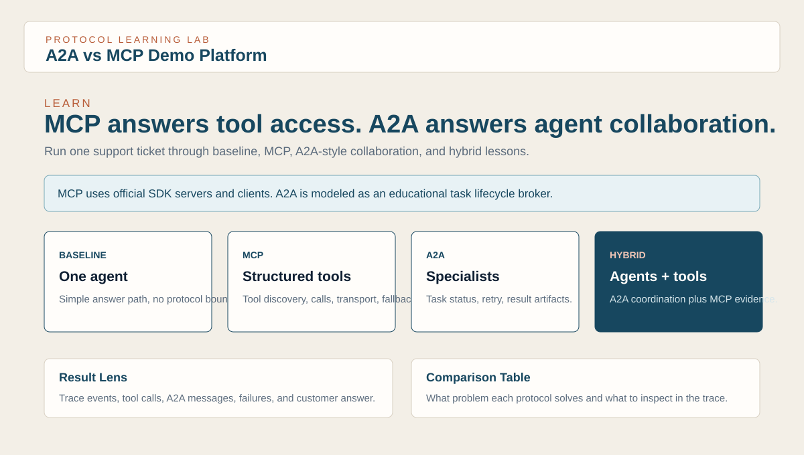
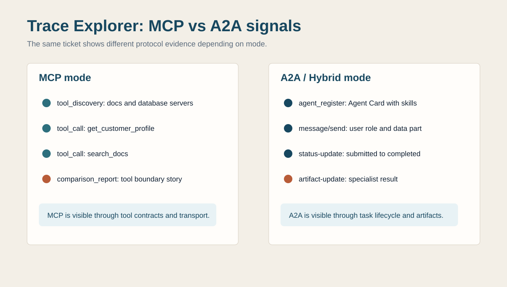

# A2A vs MCP Demo Platform

This project is a comparative learning and demo platform for understanding the difference between:

- `MCP`: how an agent connects to tools and structured external capabilities
- `A2A`: how multiple specialized agents collaborate and delegate work

It is designed for:

- deep personal learning
- architecture comparison
- a working firm demo that shows differences, similarities, pros, and cons

## Learning Path

If you are new to the project, start here:

1. Read [docs/01-mcp-vs-a2a.md](docs/01-mcp-vs-a2a.md) for the core mental model.
2. Run the app and open `/learn` for the guided MCP vs A2A lesson.
3. Run the same scenario in `baseline`, `mcp`, `a2a`, and `hybrid` modes.
4. Open `/traces` to inspect tool calls, A2A messages, retries, failures, and fallback events.
5. Save a report, then use `/reports`, `/trends`, `/presentation`, and `/telemetry` for demo and teaching workflows.

Protocol fidelity note: this project uses official MCP SDK components for the MCP path, an educational local A2A-style broker for agent collaboration concepts, and a hosted remote A2A demo binding behind `sdk_compat.py`. SDK-native A2A 1.0 migration is deferred until the official Python SDK line is stable.

## Visual Tour






Curated sample outputs live in [examples/](examples/), including a four-mode `setup_and_warranty` report, A2A/hybrid traces with protocol-shaped payloads, and a remote A2A bad-auth failure trace.

## Current Status

Current snapshot as of 2026-04-07: the project is functionally complete for the intended comparative demo, Phase 5 hardening scope, and Phase 6 hosted remote A2A demo scope.

Implemented:

- four execution modes: `baseline`, `mcp`, `a2a`, and `hybrid`
- deterministic `mock` runtime
- optional OpenAI-backed `llm` runtime with safe fallback
- official MCP SDK-based database and docs servers
- MCP transport selection with `in_process`, `stdio`, and `http`
- safe fallback from unavailable live transport to in-process execution
- hybrid-mode MCP client pooling so HTTP MCP server subprocesses are reused per run
- A2A task lifecycle with routing, retries, failures, and trace events
- deeper built-in scenarios with difficulty and tags
- expanded seed data and deterministic seed refresh
- named config profiles for `dev`, `demo`, and `llm`
- profile-aware CLI, API, and UI controls
- React + Material UI primary frontend served by FastAPI
- legacy FastAPI/Jinja dashboard preserved under `/legacy`
- report save/load APIs plus presentation-friendly HTML and PDF export
- structured NDJSON external log export for downstream analysis
- saved-report trend analytics, scorecards, recommendations, and presentation flows
- explicit FastAPI request/response schemas in `api_schemas.py`
- generated TypeScript API types from FastAPI OpenAPI
- API health/status endpoint at `/api/health`
- path-safe report lookup and clean missing report/scenario API errors
- backend and frontend regression coverage
- bounded durable multi-user persistence via `artifacts/platform_state.db`
- optional user-scoped artifacts under `artifacts/users/<user>/`
- remote MCP registry endpoints backed by `REMOTE_MCP_REGISTRY.json`
- production-style telemetry snapshot API at `/api/telemetry`
- guided `/learn` workspace for MCP vs A2A onboarding
- public GitHub readiness docs, CI workflow, Dockerfile, license, and `.env.example`
- Phase 6 hosted remote A2A with `a2a_transport=remote`, remote specialist servers, remote broker/client, registry endpoints, CLI/API/UI controls, health checks, remote failure toggles, trace filtering updates, curated examples, Docker Compose orchestration, and remote A2A check scripts

Current transport behavior:

- MCP transport choice is available in the CLI, JSON API, and UI
- `http` uses local streamable HTTP MCP server processes for a realistic network transport boundary
- hybrid HTTP mode reuses per-run MCP clients to reduce duplicate subprocess startup
- when a live transport is unavailable, the trace records both requested and active transport before falling back safely

## Architecture

### Runtime Modes

- `baseline`: one agent handles the ticket directly, with no MCP and no A2A
- `mcp`: one agent handles the ticket using MCP-backed tools
- `a2a`: triage delegates to specialists without MCP tool usage
- `hybrid`: triage delegates to specialists and those specialists use MCP-backed tools

### Key Subsystems

- `main.py`: CLI entry point
- `serve_ui.py`: FastAPI UI server entry point
- `src/a2a_vs_mcp/platform.py`: central orchestration for all modes and MCP transport selection
- `src/a2a_vs_mcp/reasoning.py`: deterministic and OpenAI-backed classification/summarization
- `src/a2a_vs_mcp/a2a/broker.py`: agent registration, routing, retries, lifecycle events, and A2A-shaped task trace payloads
- `src/a2a_vs_mcp/a2a/protocol.py`: educational A2A 1.0-shaped Agent Card, message, task status, and artifact payload helpers
- `src/a2a_vs_mcp/mcp_servers/`: official `FastMCP` database and docs servers
- `src/a2a_vs_mcp/mcp/client.py`: in-process, stdio, and HTTP MCP invocation wrapper
- `src/a2a_vs_mcp/reporting.py`: report persistence, safe report lookup, scorecards, trend analysis, and export
- `src/a2a_vs_mcp/persistence.py`: SQLite-backed report metadata, telemetry events, and remote MCP registry state
- `src/a2a_vs_mcp/identity.py`: user ID normalization and artifact root isolation helpers
- `src/a2a_vs_mcp/remote_registry.py`: remote MCP registry loading and lookup
- `src/a2a_vs_mcp/agents/`: baseline, triage, specialist, and hybrid specialist logic
- `src/a2a_vs_mcp/web.py`: FastAPI API routes, React app serving, report exports, and legacy Jinja routes
- `src/a2a_vs_mcp/api_schemas.py`: explicit API request/response contracts for FastAPI and OpenAPI
- `scripts/generate_api_types.py`: OpenAPI-to-TypeScript type generator
- `frontend/src/`: React + Material UI application
- `frontend/src/lib/types/api.generated.ts`: generated TypeScript types from the FastAPI OpenAPI schema
- `frontend/src/lib/types/api.ts`: UI-facing type aliases and normalized frontend API shapes
- `src/a2a_vs_mcp/templates/` and `src/a2a_vs_mcp/static/`: legacy server-rendered dashboard UI under `/legacy`

## Built-In Scenarios

- `order_status`
- `double_charge`
- `setup_error`
- `warranty_return`
- `delay_and_billing`
- `setup_and_warranty`
- `expired_return_active_warranty`
- `enterprise_delay_refund`
- `enterprise_setup_replacement`
- `invoice_and_warranty_followup`

The scenario catalog is also available from `/api/scenarios`, including `title`, `difficulty`, and `tags` metadata.

## Failure Simulation Controls

CLI flags:

- `--db-down`
- `--docs-timeout`
- `--disable-agent <agent_id>`
- `--malformed-task`
- `--remote-a2a-timeout`
- `--remote-a2a-bad-auth`
- `--remote-a2a-missing-capability`
- `--remote-a2a-malformed-response`
- `--remote-a2a-task-failure`

UI controls:

- database down
- docs timeout
- malformed policy task
- one or more disabled specialist agents
- remote A2A timeout, bad auth, missing capability, malformed response, and task failure toggles

## Quick Start

Run all modes:

```powershell
py main.py --scenario order_status --mode all
```

Run a multi-step scenario:

```powershell
py main.py --scenario enterprise_setup_replacement --mode hybrid
```

Run with stdio MCP transport:

```powershell
py main.py --scenario setup_error --mode mcp --mcp-transport stdio
```

Run with HTTP MCP transport:

```powershell
py main.py --scenario setup_error --mode mcp --mcp-transport http
```

Run hybrid with HTTP MCP transport:

```powershell
py main.py --scenario setup_error --mode hybrid --mcp-transport http
```

Run with failure toggles:

```powershell
py main.py --scenario warranty_return --mode all --db-down --disable-agent policy_or_billing_agent --malformed-task
```

Export presentation-friendly reports:

```powershell
py main.py --scenario delay_and_billing --mode all --save-report --export-report-html --export-report-pdf
```

Run with the OpenAI-backed runtime:

```powershell
$env:OPENAI_API_KEY="your-key"
py main.py --scenario setup_error --mode all --runtime llm
```

Build and start the primary UI:

```powershell
cd frontend
npm.cmd install
npm.cmd run build
cd ..
py serve_ui.py
```

Then open `http://127.0.0.1:8008` for the React frontend. Start with `http://127.0.0.1:8008/learn` if you want the guided MCP vs A2A lesson. The legacy server-rendered dashboard is available at `http://127.0.0.1:8008/legacy`.

Start the React frontend in Vite dev mode:

```powershell
cd frontend
npm.cmd install
npm.cmd run dev
```

Keep the FastAPI backend running on `http://127.0.0.1:8008`. The Vite dev server proxies `/api/*` and `/reports/*` to that backend by default.

Regenerate frontend API types after backend schema changes:

```powershell
py scripts\generate_api_types.py
```

Phase 5 demo operations:

```powershell
powershell.exe -ExecutionPolicy Bypass -File scripts\demo_check.ps1 -Profile demo -Transport in_process
powershell.exe -ExecutionPolicy Bypass -File scripts\demo_reset.ps1 -DryRun -ClearReports -ClearTraces -ClearLogs
powershell.exe -ExecutionPolicy Bypass -File scripts\demo_reset.ps1 -ResetRemoteRegistry
powershell.exe -ExecutionPolicy Bypass -File scripts\demo_start.ps1 -Profile demo
py scripts\validate_scenarios.py
py scripts\validate_presets.py
py scripts\inspect_platform_state.py
py scripts\check_remote_mcp.py --db-url http://127.0.0.1:9001/mcp --docs-url http://127.0.0.1:9002/mcp
py scripts\eval_demo.py --scenarios order_status,setup_error --modes baseline,mcp --html
py scripts\export_evidence_bundle.py TICKET-1001_report.json
py scripts\import_evidence_bundle.py artifacts\evidence\TICKET-1001_report_evidence_bundle.zip
py scripts\transport_diagnostics.py --scenario setup_error
```

Scenario authoring guidance lives in [SCENARIO_AUTHORING.md](SCENARIO_AUTHORING.md). Curated presenter presets live in [DEMO_PRESETS.json](DEMO_PRESETS.json).

The React run workspace also includes saved demo preset selection and guided story controls for stepping through `baseline`, `mcp`, `a2a`, and `hybrid` runs.

Remote MCP endpoint mode:

```powershell
py main.py --scenario setup_error --mode mcp --mcp-transport remote_http --remote-mcp-db-url http://127.0.0.1:9001/mcp --remote-mcp-docs-url http://127.0.0.1:9002/mcp
```

The React run workspace exposes the same `remote_http` transport option. Remote endpoints must expose the same tool names as the local DB and docs MCP servers; unavailable remote endpoints fall back to local in-process MCP and record the fallback in the trace. See [REMOTE_MCP.md](REMOTE_MCP.md) for the required tool contract and readiness check.

Remote MCP registry entries live in [REMOTE_MCP_REGISTRY.json](REMOTE_MCP_REGISTRY.json) and are exposed through `/api/mcp/registry`. The React run workspace shows those registry entries when `remote_http` is selected.

Check remote endpoint readiness:

```powershell
powershell.exe -ExecutionPolicy Bypass -File scripts\demo_check.ps1 -Profile demo -Transport remote_http -RemoteDbUrl http://127.0.0.1:9001/mcp -RemoteDocsUrl http://127.0.0.1:9002/mcp
```

Saved report detail pages include HTML export, PDF export, and evidence bundle download actions.


Remote A2A endpoint mode:

Start the hosted specialist services:

```powershell
powershell.exe -ExecutionPolicy Bypass -File scripts\start_remote_a2a.ps1
```

Check the remote Agent Cards and task path:

```powershell
py scripts\check_remote_a2a.py
```

Run through hosted remote A2A specialists:

```powershell
py main.py --scenario warranty_return --mode a2a --a2a-transport remote
py main.py --scenario setup_and_warranty --mode hybrid --a2a-transport remote --mcp-transport in_process
```

The React run workspace exposes the same `A2A Transport` control plus remote A2A failure toggles for timeout, bad auth, missing capability, malformed response, and task failure. Remote A2A defaults live in [REMOTE_A2A_REGISTRY.json](REMOTE_A2A_REGISTRY.json), and the backend exposes `/api/a2a/registry` plus `/api/a2a/health`. See [REMOTE_A2A.md](REMOTE_A2A.md).

Remote URL safety note: API-submitted remote MCP/A2A URLs are local/private by default. Set `A2A_VS_MCP_ALLOW_EXTERNAL_REMOTE_URLS=true` only in trusted deployments that intentionally call external hosted endpoints.

Docker Compose quickstart for the web app plus all three hosted A2A specialists:

```powershell
powershell.exe -ExecutionPolicy Bypass -File scripts\docker_compose_smoke.ps1
```

Use `-KeepRunning` if you want to keep the Compose services online after the smoke check. The smoke wrapper writes generated reports and exports under `.tmp\compose_smoke_artifacts` by default.

Optional user-scoped persistence:

```powershell
curl.exe -H "X-Demo-User: alice" http://127.0.0.1:8008/api/reports
```

You can also pass `user_id` in API run payloads or report export query strings. Non-default users store reports, traces, and logs under `artifacts/users/<user>/`; the default local demo behavior continues to use `artifacts/reports`, `artifacts/traces`, and `artifacts/logs`.

Set `A2A_VS_MCP_ARTIFACT_ROOT` to redirect generated databases, reports, traces, logs, and telemetry into a throwaway directory. The test suite uses this to avoid writing into the normal demo artifact tree.

Telemetry snapshot:

```powershell
curl.exe http://127.0.0.1:8008/api/telemetry
curl.exe "http://127.0.0.1:8008/api/telemetry?all_users=true"
```

Run verification:

```powershell
py -m unittest discover -s tests
cd frontend
npm.cmd test
npm.cmd run build
```

Current verification status:

- backend tests: 54 passing
- frontend tests: 5 files / 10 tests passing
- frontend production build: passing
- Docker image build: passing
- Docker Compose smoke check: web app plus three hosted A2A specialists start, health checks pass, remote Agent Cards are reachable, remote A2A API run returns successfully, and services shut down cleanly

## Report And API Endpoints

UI routes:

- `/learn`: guided MCP vs A2A learning workspace
- `/`: React run workspace
- `/reports`: React saved-report library
- `/reports/{report_name}`: React saved-report detail view
- `/traces`: React trace workspace
- `/trends`: React saved-report trend workspace
- `/presentation`: React presentation mode
- `/legacy`: legacy server-rendered dashboard
- `/legacy/trends`: legacy saved-report trend panel
- `/legacy/reports/{report_name}`: legacy saved-report reload panel
- `/reports/{report_name}/export`: presentation-friendly HTML export
- `/reports/{report_name}/export.pdf`: presentation-friendly PDF export

JSON API routes:

- `/api/health`: backend status, version, profile, frontend build, artifact path, and transport defaults
- `/api/scenarios`: scenario catalog with difficulty and tags
- `/api/run`: run one or more modes and optionally save the report
- `/api/reports`: list saved report summaries
- `/api/reports/{report_name}`: load a saved report payload plus summary
- `/api/reports/trends`: aggregate saved-report trends, with optional filters by scenario, runtime, and recommended mode
- `/api/mcp/registry`: list configured remote MCP registry entries
- `/api/mcp/registry/sync`: sync `REMOTE_MCP_REGISTRY.json` into the durable registry table
- `/api/a2a/registry`: list configured remote A2A specialist endpoints
- `/api/a2a/health`: check configured remote A2A specialist health
- `/api/telemetry`: run/report/failure/tool/A2A telemetry snapshot, optionally across all users
- `/telemetry`: React telemetry overview for durable Phase 5 state
- `/openapi.json`: FastAPI OpenAPI schema used by the frontend type generator

These endpoints back the React frontend and remain available to the legacy server-rendered UI.

## Current UI Features

Legacy server-rendered dashboard:

- scenario selector and custom ticket input
- named config profile selection with effective runtime and transport visibility
- mode, runtime override, and MCP transport override selection
- failure toggles for resilience demos
- saved report loading
- HTML and PDF export links
- structured external log export toggle
- report scorecards with per-mode recommendations and sort controls
- saved-report trend view with filters, active filter chips, drill-down actions, and sortable tables
- trace timelines for each run mode

React frontend:

- routed run, report, trace, trend, and presentation workspaces
- shareable URL-driven state for run setup and for reports, traces, and trends
- NDJSON log import and replay in the trace workspace
- report detail pages with exports, scorecards, charts, and traces
- chart-driven analytics with downloadable SVG snapshots and chart share links
- presentation presets with keyboard shortcuts and fullscreen-friendly reduced chrome mode
- shared toast feedback system for copy and download actions
- loading skeleton system for major API-driven screens
- Vitest coverage for URL state, chart actions, presentation shortcuts, and cross-route workflows

## Phase Status

- Phase 1: complete
- Phase 2: complete
- Phase 3: complete for backend, reporting, transport, and original dashboard scope
- Phase 4: functionally complete for the current React frontend and backend hardening scope
- Phase 5: complete for demo reliability, scenario authoring, evaluation, evidence bundles, remote MCP registry support, telemetry, durable state, and bounded user-scoped artifacts
- Phase 6: complete for demo scope. Implemented hosted remote A2A specialist servers, remote client/broker integration, CLI/API/UI transport controls, registry and health endpoints, remote failure toggles, trace filtering updates, Docker Compose orchestration and smoke verification, curated remote examples, and remote A2A verification scripts. SDK-native A2A 1.0 migration is deferred until the official Python SDK line is stable; the optional stable SDK extra is pinned to `a2a-sdk[http-server]==0.3.25`.

## What Is Left

Nothing major is required for the current local/demo or hosted remote A2A demo scope.

Phase 5 is implemented for the local/demo platform scope. The remaining product-grade items, such as production authentication, public hosting hardening, managed remote MCP credentials, and full secure multi-tenant isolation, are intentionally deferred.

Phase 6 is implemented for hosted remote A2A, not just local A2A-style collaboration. See [PHASE6.md](PHASE6.md), [REMOTE_A2A.md](REMOTE_A2A.md), and [docs/05-remote-a2a-presentation.md](docs/05-remote-a2a-presentation.md).

See [PHASE5_COMPLETE.md](PHASE5_COMPLETE.md) for the completion checklist and verification commands.

## Documentation

- [docs/01-mcp-vs-a2a.md](docs/01-mcp-vs-a2a.md): conceptual MCP vs A2A mental model
- [docs/02-architecture.md](docs/02-architecture.md): codebase and runtime architecture walkthrough
- [docs/03-demo-script.md](docs/03-demo-script.md): five-minute and fifteen-minute demo scripts
- [docs/04-public-github.md](docs/04-public-github.md): public clone-and-run readiness checklist
- [docs/05-remote-a2a-presentation.md](docs/05-remote-a2a-presentation.md): remote A2A presenter cue card
- [docs/06-demo-runbook.md](docs/06-demo-runbook.md): operator checklist, smoke checks, reset flow, and demo fallbacks
- [docs/IMPROVEMENTS.md](docs/IMPROVEMENTS.md): implementation improvement log
- [examples/](examples/): curated sample report and trace outputs for public readers
- [Plan.md](Plan.md): current project architecture and direction
- [PHASE2.md](PHASE2.md): Phase 2 completion summary in current context
- [PHASE3.md](PHASE3.md): Phase 3 completion status in current context
- [PHASE4.md](PHASE4.md): Phase 4 completion status and optional follow-on work
- [PHASE5.md](PHASE5.md): Phase 5 implementation record and retained planning context
- [PHASE5_COMPLETE.md](PHASE5_COMPLETE.md): Phase 5 completion checklist and verification commands
- [PHASE6.md](PHASE6.md): hosted remote A2A completion record, architecture, deliverables, and verification checklist
- [REMOTE_A2A.md](REMOTE_A2A.md): hosted remote A2A specialist server setup and verification


