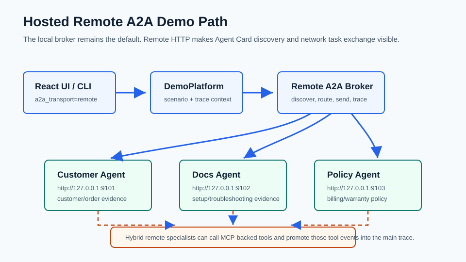

# Remote A2A Presentation Cue Card

Use this when you want to show the hosted remote A2A path without drifting into SDK migration details.



## Demo Arc

1. Start the web app and remote specialists:

```powershell
docker compose up --build -d
```

2. Confirm the hosted specialists are reachable:

```powershell
py scripts\check_remote_a2a.py
```

3. Open `http://127.0.0.1:8008`.
4. Choose `warranty_return` or `setup_and_warranty`.
5. Set `A2A Transport` to `Remote HTTP`.
6. Run `a2a`, then run `hybrid`.
7. Open the trace and point to remote Agent Card discovery, remote sends, status updates, artifacts, and promoted MCP tool events in hybrid mode.
8. Stop the demo services:

```powershell
docker compose down
```

## Failure Moment

Use bad auth when you want a short, readable remote failure:

```powershell
py main.py --scenario warranty_return --mode a2a --a2a-transport remote --remote-a2a-bad-auth
```

Curated examples:

- `examples/warranty_return_remote_a2a_bad_auth_trace.json`
- `examples/warranty_return_remote_a2a_bad_auth_report.json`

## Presenter Language

- Local A2A: "The broker keeps the agent collaboration lifecycle visible inside one process."
- Remote A2A: "The same delegation story now crosses an HTTP boundary and discovers hosted specialist Agent Cards."
- Hybrid remote: "Hosted specialists collaborate through A2A and use MCP-backed tools for evidence."

Avoid saying this is a production A2A SDK-native 1.0 server. The demo uses a versioned remote HTTP binding behind `sdk_compat.py`; SDK-native A2A 1.0 migration is deferred until the official Python SDK line is stable.
