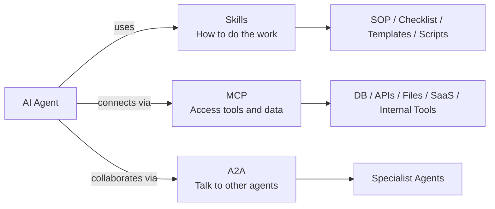
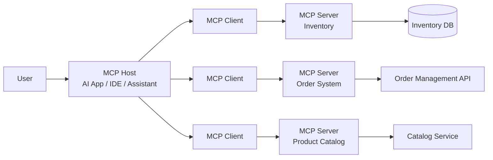
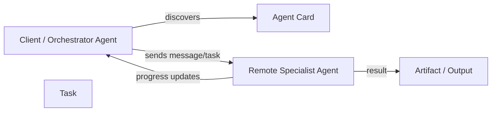
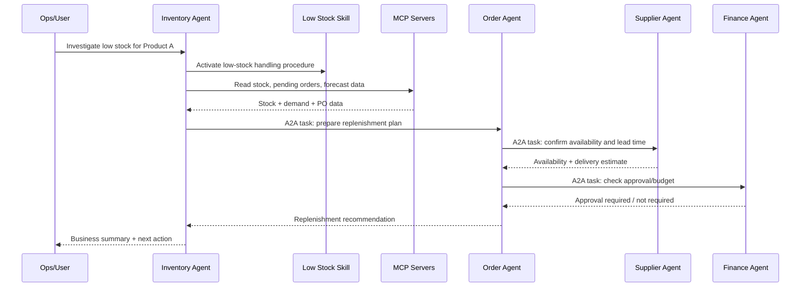
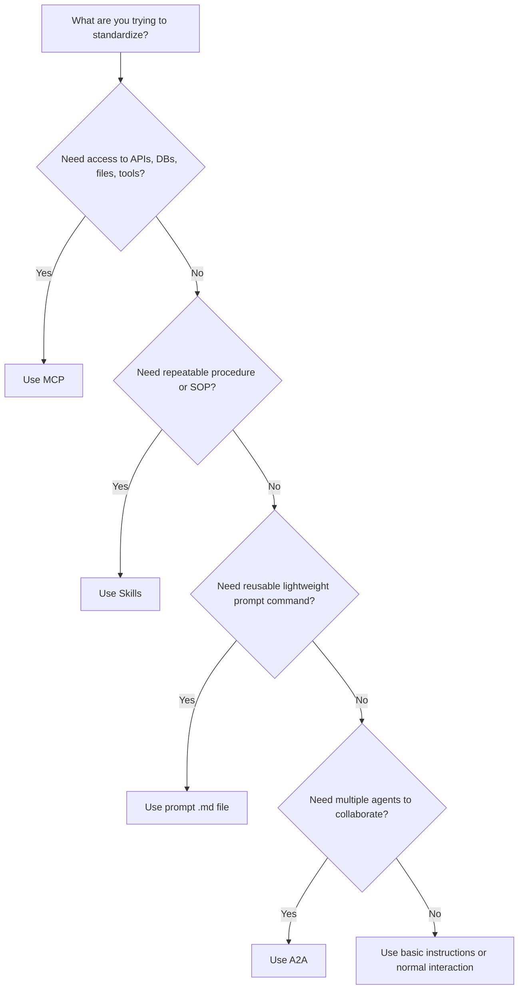

# A2A, MCP, and Agent Skills — How They Fit Together in Real Enterprise Agent Workflows

> **Audience:** Mixed technical + product/management  
> **Duration:** 20–30 minutes  
> **Recommended slide count:** 18–20 slides  
> **Main example domain:** Generic retail/e-commerce  
> **Main focus:** A2A, MCP, and Skills  
> **Light touch:** Agents, instructions, and reusable prompt `.md` files used in tools like Claude Code or GitHub Copilot

---

## Presenter framing

### Core message
A2A, MCP, and Skills are not competing concepts. They solve three different problems in enterprise AI agent systems.

| Problem | Best-fit concept | Simple meaning |
|---|---|---|
| My agent needs to access real systems | **MCP** | Agent ↔ tools/data/systems |
| My agent needs to follow a repeatable process | **Skills** | Agent ↔ procedural playbook |
| My agent needs to collaborate with another agent | **A2A** | Agent ↔ agent |

### Simple memory hook
Think of an AI agent as a new digital employee in a retail company:

- **MCP = system access**  
  Access to inventory DB, ERP, CRM, payment system, order management, warehouse system, etc.

- **Skills = SOP / playbook**  
  How to handle low stock, how to prepare a supplier order, how to investigate payment failure, how to generate weekly category performance report.

- **A2A = teamwork**  
  Inventory agent talks to order agent, supplier agent, finance agent, customer support agent, campaign agent, etc.

### Speaker line
> “An intelligent agent is useful. But an intelligent agent with system access, company process knowledge, and the ability to collaborate becomes far more useful in real enterprise work.”

---

# Recommended 20-Slide Structure

---

## Slide 1 — Why This Topic Matters

### Slide idea
AI agents are moving from simple chatbots to digital workers. But real work is not just answering questions.

### Talking points
In a company, useful work usually needs:

1. **Access**  
   The agent must reach actual systems: inventory, orders, logs, documents, databases, APIs, ticketing tools.

2. **Process knowledge**  
   The agent must know how work is done: steps, approvals, templates, policies, exceptions.

3. **Collaboration**  
   The agent may need help from other specialist agents: finance, support, legal, supplier, engineering.

### Retail example
A user asks:

> “Why is this product showing as available on the website but customers are getting out-of-stock errors at checkout?”

This is not a simple Q&A task. The agent may need to:

- Check product inventory.
- Check warehouse stock sync.
- Check order failures.
- Check recent catalog updates.
- Coordinate with another agent responsible for order systems.
- Prepare a business-friendly summary.

### Speaker line
> “This is exactly where A2A, MCP, and Skills become important. They help agents move from talking about work to actually participating in work.”

---

## Slide 2 — The Three Building Blocks

### Slide idea
Introduce the three concepts in one clean view.



### One-line explanation

| Concept | One-line meaning |
|---|---|
| **MCP** | Standard way for agents to connect to external tools, APIs, files, databases, and systems |
| **Skills** | Reusable packaged workflow that teaches an agent how to perform a specific task |
| **A2A** | Standard way for one agent to communicate and coordinate with another agent |

### Speaker line
> “MCP gives the agent access, Skills give the agent procedure, and A2A gives the agent teammates.”

---

## Slide 3 — Quick Foundation: Agent, Instruction, Prompt `.md`, Skill

### Slide idea
Clarify related terms without going too deep.

| Concept | What it means | Best used for | Retail/e-commerce example |
|---|---|---|---|
| **Agent** | AI-powered worker that can reason, plan, use tools, and complete goals | A complete role or worker | Inventory Agent, Pricing Agent, Support Agent |
| **Instructions** | Persistent rules for how the agent should behave | Broad behavior and standards | “Always explain customer impact before technical root cause.” |
| **Prompt `.md` file** | Reusable prompt stored as Markdown and invoked manually, often as slash command or prompt file | Lightweight repeatable task guidance | `/create-product-summary` or `weekly-category-report.prompt.md` |
| **Skill** | Packaged capability with `SKILL.md`, metadata, detailed instructions, and optional scripts/assets/references | Repeatable multi-step workflow or domain capability | “Low-stock handling skill” with SOP, thresholds, supplier rules, and scripts |

### Important clarification
Here, **prompt** does not mean only a one-time message typed by a user. In coding assistants like Claude Code or GitHub Copilot, teams can create reusable Markdown prompt files.

Examples:

```text
.github/prompts/create-api-review.prompt.md
.claude/commands/refactor.md
```

These are more reusable than a normal one-time chat prompt, but usually lighter than a full Skill.

### Speaker line
> “For this presentation, when I say prompt files, I mean reusable Markdown prompt files used by developer tools, not just one-time user prompts.”

---

## Slide 4 — What Is MCP?

### Slide idea
MCP is the access layer for agents.

### Definition
**MCP stands for Model Context Protocol.** It standardizes how AI applications and agents connect to external systems and context providers.

### What MCP helps with
MCP helps an agent access:

- Files
- Databases
- Internal APIs
- GitHub or code repositories
- SaaS systems
- Ticketing systems
- Monitoring tools
- CRM/ERP systems
- Product catalog systems
- Order management systems

### Simple explanation
Without MCP, every agent application may need a custom integration for every system.

```text
Agent A → custom DB integration
Agent A → custom GitHub integration
Agent A → custom Jira integration
Agent B → custom DB integration again
Agent B → custom GitHub integration again
```

With MCP, a team can build or reuse an MCP server for a system and allow compatible AI applications to connect through a standard pattern.

### Speaker line
> “MCP is like a universal adapter for agents. It reduces custom glue code between agents and enterprise systems.”

---

## Slide 5 — MCP Architecture in Simple Terms

### Slide idea
Show host, client, server, and systems.



### Components

| Component | Meaning | Example |
|---|---|---|
| **MCP Host** | AI app where the agent runs | Claude Code, internal AI assistant, IDE assistant |
| **MCP Client** | Connection manager from host to one MCP server | Client connection to inventory MCP server |
| **MCP Server** | Program that exposes tools/resources/prompts from a system | Inventory MCP server, database MCP server |
| **External System** | Actual system being accessed | Inventory DB, ERP, order API, product catalog |

### Speaker line
> “The agent does not need to know the low-level details of the database or API. The MCP server exposes a controlled interface.”

---

## Slide 6 — MCP Primitives: Tools, Resources, Prompts

### Slide idea
Explain the three common MCP server primitives.

| MCP primitive | Meaning | Retail/e-commerce example |
|---|---|---|
| **Tools** | Actions the model can invoke | `get_stock_level`, `create_purchase_order`, `update_product_status` |
| **Resources** | Data/context the model can read | Product record, inventory schema, order log, pricing policy document |
| **Prompts** | Reusable interaction templates exposed by MCP server | “Create incident summary from order failure logs” |

### Important note
MCP prompts are not the main focus of this presentation. They are prompt templates exposed by an MCP server. This is different from GitHub Copilot `.prompt.md` files or Claude Code command Markdown files, which are reusable prompt files stored in a workspace/user configuration.

### Speaker line
> “MCP is mainly about what the agent can reach and what actions it can safely perform.”

---

## Slide 7 — MCP Retail Example: Product Availability Issue

### Scenario
Customer support reports:

> “Customers can add Product A to cart, but checkout fails saying out of stock.”

### Without MCP
A human has to copy-paste:

- Product details
- Stock level screenshots
- Order failure logs
- Warehouse sync status
- Recent catalog changes

### With MCP
The agent can use MCP-connected systems:

| System | MCP use |
|---|---|
| Product Catalog | Read product status and availability rules |
| Inventory DB | Check stock by warehouse/location |
| Order System | Check failed checkout logs |
| Warehouse Sync | Check last sync time/status |
| Ticketing Tool | Create or update incident ticket |

### Flow
1. User asks the agent to investigate.
2. Agent reads product catalog resource through MCP.
3. Agent calls inventory tool through MCP.
4. Agent checks order failure logs through MCP.
5. Agent identifies mismatch between website stock and warehouse stock.
6. Agent creates ticket or draft RCA through MCP.

### Speaker line
> “MCP lets the agent work with real operational data instead of depending only on copied context.”

---

## Slide 8 — What MCP Does Not Solve

### Slide idea
Set clear boundaries.

| MCP does | MCP does not |
|---|---|
| Connects agents to tools/data/systems | Define the complete business workflow by itself |
| Standardizes access patterns | Automatically coordinate multiple agents |
| Exposes tools, resources, and prompt templates | Teach company SOP unless encoded elsewhere |
| Reduces repeated custom integration work | Replace security and approval controls |

### Key point
MCP gives access. It does not automatically tell the agent the correct business process.

### Speaker line
> “MCP can get the data and perform actions, but the agent still needs a playbook for how to handle the case correctly.”

---

## Slide 9 — What Are Agent Skills?

### Slide idea
Skills are procedural memory for agents.

### Definition
**Agent Skills are reusable packages that teach an agent how to perform a specific task or workflow.**

A skill commonly contains a `SKILL.md` file and may include additional folders for scripts, references, and assets.

### Simple analogy
Skills are like:

- SOPs
- Playbooks
- Runbooks
- Checklists
- Templates
- Reusable team workflows
- Packaged domain expertise

### Retail example
A normal model may know what “low stock” means, but it may not know your company’s exact process:

- What threshold counts as low stock?
- Which warehouse should be checked first?
- Which supplier should be contacted?
- Who approves emergency replenishment?
- What format should the purchase order summary follow?
- What exceptions apply for seasonal products?

A Skill can encode this process.

### Speaker line
> “Skills teach agents how work is done here — not just what the words mean.”

---

## Slide 10 — What a Skill Looks Like

### Slide idea
Show the simple structure.

```text
low-stock-handling/
├── SKILL.md
├── scripts/
│   └── validate_reorder_quantity.py
├── references/
│   └── supplier_policy.md
└── assets/
    └── purchase_order_template.xlsx
```

### Example `SKILL.md`

```yaml
---
name: low-stock-handling
description: Use this skill when a product is below reorder threshold or stock mismatch is reported.
---
```

```markdown
# Low Stock Handling Skill

## Steps
1. Check current stock by warehouse.
2. Compare stock against reorder threshold.
3. Check pending purchase orders.
4. Validate seasonal demand factor.
5. Recommend reorder quantity.
6. Create purchase order draft.
7. Notify operations and category manager.

## Rules
- Do not create a purchase order if stock is reserved for existing orders.
- Escalate if supplier lead time is more than 7 days.
- For high-margin products, flag business impact separately.
```

### Speaker line
> “A skill can be very simple to write, but it captures a lot of operational judgment that would otherwise remain tribal knowledge.”

---

## Slide 11 — Progressive Disclosure: Why Skills Scale

### Slide idea
Explain why skills do not overload the context window.

### Problem
If an agent has 100 skills and loads every full skill into context, the context window becomes crowded and expensive.

### Solution
Skills use progressive disclosure.

| Tier | What is loaded | When it is loaded |
|---|---|---|
| **Tier 1** | Name + description | At startup, as lightweight index |
| **Tier 2** | Full `SKILL.md` body | When the task matches the skill |
| **Tier 3** | Scripts, references, assets | Only when the task needs them |

### Retail analogy
It is like an employee knowing that a “Low Stock SOP” exists, but opening the full SOP only when a low-stock case appears.

### Speaker line
> “Skills scale because the agent first sees a lightweight menu, then opens only the relevant playbook.”

---

## Slide 12 — Prompt `.md` Files vs Skills vs Instructions vs Agents

### Slide idea
Address the user’s clarification directly: reusable prompt Markdown files, not just normal user prompts.

### Practical comparison

| Item | Where it lives | How it is triggered | Best for | Example |
|---|---|---|---|---|
| **Instructions** | Agent/app/system settings or repo instruction files | Automatically applied | Broad standards | “Use our TypeScript style guide.” |
| **Prompt `.md` file** | Workspace/user folder, often invoked manually | User invokes like `/review-pr` or runs a prompt file | Lightweight repeatable task | `review-pr.prompt.md`, `.claude/commands/refactor.md` |
| **Skill** | Skill folder with `SKILL.md` and optional assets/scripts | Agent triggers when relevant, or user invokes directly if supported | Larger repeatable capability/workflow | `low-stock-handling/SKILL.md` |
| **Agent** | AI worker/configuration | Assigned a goal or role | End-to-end specialist role | Inventory Agent, Supplier Agent |

### When prompt `.md` files are enough
Use reusable prompt files when:

- The task is small or medium-sized.
- The workflow is mostly natural-language guidance.
- You want a quick slash command or reusable dev workflow.
- You do not need supporting scripts, templates, or reference folders.

Example:

```text
.github/prompts/review-pr.prompt.md
```

Purpose:

> Review a pull request using team code review standards and produce risks, suggestions, and test gaps.

### When to upgrade from prompt `.md` file to Skill
Upgrade to a Skill when:

- The workflow has many steps.
- The workflow needs supporting files.
- The workflow needs executable scripts.
- The workflow should be portable across tools/agents.
- The agent should auto-discover and trigger it based on metadata.

### Speaker line
> “Prompt files are like reusable shortcuts. Skills are more like packaged capabilities with a playbook and optional tools/resources.”

---

## Slide 13 — What Is A2A?

### Slide idea
A2A is the collaboration layer between agents.

### Definition
**A2A stands for Agent-to-Agent protocol.** It enables agents built by different teams, frameworks, or vendors to communicate, delegate tasks, exchange messages, and coordinate work.

### Simple explanation
In a company, one person does not do everything alone. Work is divided among specialists.

In an AI ecosystem, we may also have specialist agents:

- Inventory Agent
- Order Agent
- Supplier Agent
- Payment Agent
- Customer Support Agent
- Pricing Agent
- Campaign Agent
- Reporting Agent

A2A gives them a common communication pattern.

### Speaker line
> “A2A is not about connecting to databases. It is about one agent asking another capable agent to help.”

---

## Slide 14 — A2A Core Concepts

### Slide idea
Explain Agent Card, Message, Task, Artifact, and streaming.



### Core concepts

| Concept | Meaning | Retail example |
|---|---|---|
| **Agent Card** | Metadata describing agent identity, endpoint, capabilities, skills, auth | Supplier Agent advertises it can check product availability |
| **Message** | Communication between agents | “Can you validate supplier stock for SKU-123?” |
| **Task** | Stateful unit of work for longer operations | “Negotiate replenishment options for 500 units” |
| **Artifact** | Tangible output/result | Supplier quote, delivery estimate, report, JSON result |
| **Streaming / Updates** | Progress updates during long tasks | “Supplier 1 checked, Supplier 2 pending…” |

### Speaker line
> “The Agent Card works like a digital profile. It tells other agents what this agent can do and how to talk to it.”

---

## Slide 15 — A2A Retail Example: Low-Stock Replenishment

### Scenario
The system detects that Product A is below stock threshold.

### Agents involved

| Agent | Responsibility |
|---|---|
| Inventory Agent | Detects low stock |
| Order Agent | Creates replenishment plan |
| Supplier Agent | Confirms availability, price, delivery |
| Finance Agent | Checks budget/approval requirement |
| Operations Agent | Confirms warehouse receiving capacity |
| Category Manager Agent | Reviews business priority |

### A2A flow
1. Inventory Agent detects stock below threshold.
2. Inventory Agent sends task to Order Agent.
3. Order Agent asks Supplier Agent for availability and delivery estimate.
4. Order Agent asks Finance Agent whether approval is required.
5. Supplier Agent streams updates while checking availability.
6. Finance Agent responds with budget/approval requirement.
7. Order Agent prepares final replenishment recommendation.

### Speaker line
> “A2A becomes useful when the work naturally belongs to multiple specialist agents, not one giant agent.”

---

## Slide 16 — Combined Example: A2A + MCP + Skills Together

### Slide idea
Show how all three concepts work together in one realistic retail/e-commerce workflow.

### Scenario
A best-selling product is running out of stock during a sale campaign.



### What each part does

| Layer | Role in this scenario |
|---|---|
| **Skill** | Defines the low-stock SOP: steps, rules, thresholds, escalation path |
| **MCP** | Reads stock, pending purchase orders, sales velocity, campaign data |
| **A2A** | Coordinates inventory, order, supplier, and finance agents |

### Speaker line
> “This is the cleanest mental model: Skills decide the process, MCP gets the data and performs actions, A2A coordinates specialists.”

---

## Slide 17 — Main Comparison: A2A vs MCP vs Skills

### Slide idea
One practical comparison table.

| Dimension | MCP | Skills | A2A |
|---|---|---|---|
| Main purpose | Connect to tools/data/systems | Teach repeatable procedures | Connect agents to agents |
| Communication | Agent/app ↔ MCP server ↔ system | Agent ↔ skill files | Agent ↔ remote agent |
| Main object | Tool, resource, prompt | `SKILL.md`, scripts, references, assets | Agent Card, message, task, artifact |
| Best for | Data access and system actions | SOPs, checklists, workflows, reusable task knowledge | Multi-agent delegation and coordination |
| Retail example | Query inventory DB | Follow low-stock handling process | Inventory Agent asks Supplier Agent for availability |
| Solves | Integration/access problem | Procedural knowledge problem | Collaboration/orchestration problem |
| Does not solve | Business process by itself | External system access by itself | Tool/data access by itself |

### Speaker line
> “The difference is simple: MCP is access, Skills are procedure, A2A is collaboration.”

---

## Slide 18 — When to Use What

### Slide idea
Give the audience a practical decision guide.



### Practical rules

| Situation | Use |
|---|---|
| “The agent needs to query inventory DB.” | **MCP** |
| “The agent must follow our low-stock SOP.” | **Skill** |
| “I want a reusable PR review command in Copilot/Claude Code.” | **Prompt `.md` file** |
| “The inventory agent must ask supplier and finance agents for help.” | **A2A** |
| “The agent should always speak in business-friendly language.” | **Instructions** |
| “I need a complete specialist worker.” | **Agent** |

### Speaker line
> “Before choosing the technology, ask: is this an access problem, a process problem, a reusable prompt shortcut, or a collaboration problem?”

---

## Slide 19 — Common Misunderstandings

### Slide idea
Prevent confusion.

| Misunderstanding | Correction |
|---|---|
| “MCP and A2A are the same.” | MCP connects agents to systems. A2A connects agents to agents. |
| “Skills are just prompts.” | Skills are packaged workflows with metadata and optional scripts/assets/references. |
| “Prompt `.md` files and Skills are always the same.” | Prompt files are usually lightweight manual reusable prompts; Skills are richer capabilities/playbooks. Some tools may blur the boundary, but conceptually they serve different depth levels. |
| “A2A can replace MCP.” | A2A helps agents communicate, but each agent may still need MCP to access systems. |
| “MCP tells the agent the business process.” | MCP exposes capabilities; Skills or instructions define how to use them correctly. |
| “One big agent is enough.” | Sometimes yes, but specialist agents are easier to govern, scale, and assign responsibility. |

### Speaker line
> “Most confusion happens when we treat these as competing options. They are really layers of an agent ecosystem.”

---

## Slide 20 — Security, Governance, and Closing Takeaway

### Slide idea
Close with responsible adoption.

### Governance concerns

| Area | Risk | Practical control |
|---|---|---|
| **MCP** | Tools may read/write sensitive systems | Scope tools, permissions, logging, human approval for high-impact actions |
| **Skills** | Skills can include executable scripts or hidden unsafe instructions | Review like software dependencies, version control, trusted sources only |
| **A2A** | Remote agents may be unknown or over-trusted | Authentication, authorization, agent identity, audit logs, allowlist trusted agents |
| **Prompt `.md` files** | Reusable prompts can encode poor practices | Code review, repo ownership, testing on real examples |

### Final takeaway

| Concept | Final one-liner |
|---|---|
| **MCP** | Gives agents controlled access to tools and data |
| **Skills** | Give agents repeatable procedural knowledge |
| **A2A** | Lets agents collaborate with other agents |
| **Prompt `.md` files** | Provide lightweight reusable prompt shortcuts |
| **Instructions** | Set broad behavior rules |
| **Agents** | Execute goals using all of the above |

### Closing speaker line
> “To build practical enterprise agents, we need more than a smart model. We need controlled access, repeatable process knowledge, and collaboration. MCP, Skills, and A2A give us those three layers.”

---

# Optional Appendix — More Detailed Presenter Notes

---

## Appendix A — The Retail/E-commerce Story You Can Use Throughout

### Story title
**From Low Stock Alert to Replenishment Decision**

### Business context
A retail company is running a weekend sale. Product A is selling faster than expected. Inventory is low, and the website is still showing availability. The operations team wants to avoid customer frustration and revenue loss.

### What happens without these standards
A human team member must:

1. Open product catalog.
2. Check inventory DB.
3. Check warehouse sync status.
4. Check pending orders.
5. Check supplier portal.
6. Ask finance for budget approval.
7. Prepare summary.
8. Create purchase order.
9. Notify operations.

This means switching between systems, copying data, and manually coordinating multiple people.

### What happens with agents + MCP + Skills + A2A

| Step | Technology used | Explanation |
|---|---|---|
| Inventory Agent receives low-stock question | Agent | Main worker receives goal |
| Agent activates low-stock process | Skill | Skill defines SOP and rules |
| Agent checks inventory/product/order data | MCP | MCP provides system access |
| Agent asks Supplier Agent for availability | A2A | Agent-to-agent delegation |
| Agent asks Finance Agent for budget rule | A2A | Specialist validation |
| Agent creates PO draft | MCP | System action through ERP/order tool |
| Agent prepares final summary | Skill | Output follows standard format |

### Simple speaker line
> “This one example shows all three clearly: Skills define the process, MCP connects to systems, and A2A coordinates specialist agents.”

---

## Appendix B — Prompt `.md` Files: Practical Examples

### Example 1 — GitHub Copilot prompt file

```text
.github/prompts/review-ecommerce-api.prompt.md
```

```yaml
---
description: Review an e-commerce API change for correctness, security, performance, and missing tests.
agent: agent
tools: ['search/codebase']
---
```

```markdown
Review the selected API change.

Check:
1. API contract compatibility
2. Authentication and authorization
3. Validation and error handling
4. Database query performance
5. Unit/integration test gaps
6. Backward compatibility risk

Output:
- Summary
- Risks
- Required changes
- Suggested tests
```

### Example 2 — Claude Code command Markdown file

```text
.claude/commands/explain-impact.md
```

```markdown
Explain the business and technical impact of the selected code change.

Output:
1. What changed
2. Business impact
3. Customer impact
4. Risk areas
5. Suggested validation steps

Keep it clear for both engineering and product stakeholders.
```

### When this is enough
A prompt `.md` file is enough when the task is repeatable but lightweight.

Example:

- Review PR
- Explain code impact
- Generate test ideas
- Create API documentation draft
- Prepare release note draft

### When this is not enough
Move to a Skill when you need:

- Multiple reference documents
- Templates
- Scripts
- Complex decision rules
- Versioned workflow package
- Automatic skill discovery/triggering

---

## Appendix C — Skill Example for Retail Low-Stock Handling

```text
retail-low-stock-skill/
├── SKILL.md
├── references/
│   ├── replenishment_policy.md
│   └── supplier_priority_rules.md
├── scripts/
│   └── calculate_reorder_quantity.py
└── assets/
    └── po_summary_template.xlsx
```

### Sample `SKILL.md`

```yaml
---
name: retail-low-stock-handler
description: Use this skill when stock is below threshold, a product is unavailable, or a replenishment recommendation is requested.
---
```

```markdown
# Retail Low Stock Handler

## Goal
Help the agent investigate low stock and prepare a replenishment recommendation.

## Required checks
1. Confirm product ID/SKU.
2. Check current available stock by warehouse.
3. Check reserved stock for pending orders.
4. Check sales velocity for last 7 days.
5. Check active campaign or seasonal demand.
6. Check open purchase orders.
7. Check preferred supplier and lead time.
8. Calculate recommended reorder quantity.
9. Prepare business summary.
10. Escalate if product is high-margin or campaign-critical.

## Output format
- Product
- Current available stock
- Reserved stock
- Demand trend
- Supplier availability
- Recommended quantity
- Business risk
- Next action
```

---

## Appendix D — A2A Example Agent Cards Conceptually

### Supplier Agent Card — conceptual

```json
{
  "name": "Supplier Availability Agent",
  "description": "Checks supplier stock, lead time, and quote options for retail products.",
  "capabilities": [
    "check_availability",
    "get_delivery_estimate",
    "request_quote"
  ],
  "endpoint": "https://example.com/a2a/supplier-agent"
}
```

### Finance Agent Card — conceptual

```json
{
  "name": "Finance Approval Agent",
  "description": "Validates whether replenishment orders require budget approval.",
  "capabilities": [
    "check_budget_threshold",
    "validate_approval_required"
  ],
  "endpoint": "https://example.com/a2a/finance-agent"
}
```

### Speaker note
Do not spend too much time on JSON. Use it only to explain that an Agent Card is like a profile that helps agents discover capabilities.

---

## Appendix E — Short Executive Version

Use this if you need to explain the whole topic in 2 minutes.

> “A2A, MCP, and Skills solve three different problems in agent systems. MCP connects agents to external tools and data, such as databases, APIs, files, and SaaS systems. Skills teach agents repeatable workflows, like a company SOP or playbook. A2A lets one agent communicate and coordinate with another agent. In a retail example, an Inventory Agent may use MCP to read stock data, use a low-stock Skill to follow the correct replenishment process, and use A2A to ask Supplier and Finance Agents for availability and approval. Prompt Markdown files, like Copilot `.prompt.md` files or Claude Code command files, are useful for lightweight reusable prompts, but Skills are better when the workflow becomes a larger packaged capability with scripts, references, or assets.”

---

## Appendix F — Suggested Q&A

### Q1. Are MCP, A2A, and Skills alternatives?
No. They solve different problems. MCP is for access, Skills are for procedure, and A2A is for collaboration.

### Q2. Can an agent use all three together?
Yes. In real enterprise workflows, the strongest pattern is often to combine all three.

### Q3. Can Skills replace MCP?
No. A Skill can explain how to query inventory, but MCP or another integration layer is needed to actually access the inventory system.

### Q4. Can A2A replace MCP?
No. A2A allows an agent to ask another agent for help. It does not directly connect to your database or API.

### Q5. Are prompt `.md` files the same as Skills?
Not exactly. Prompt `.md` files are usually lightweight reusable prompts or slash commands. Skills are richer packaged capabilities that may include metadata, detailed instructions, scripts, references, and assets.

### Q6. Should every workflow become a Skill?
No. Start small. Use instructions for broad behavior, prompt `.md` files for lightweight repeatable prompts, Skills for durable procedures, MCP for tool/data access, and A2A for multi-agent collaboration.

### Q7. What is the biggest security risk?
The biggest risk is allowing agents to act on real systems without proper permission, logging, review, and human approval. MCP tools, Skill scripts, and remote A2A agents all need governance.

---

## Appendix G — Source Notes

This draft was built using:

1. The provided transcript explaining A2A and MCP.
2. The provided transcript explaining Agent Skills.
3. Official A2A Protocol documentation for Agent Cards, tasks, messages, artifacts, and streaming concepts.
4. Official Model Context Protocol documentation for host/client/server architecture and tools/resources/prompts.
5. Official Claude Code and GitHub Copilot documentation for reusable Markdown prompt/command files and skills concepts.

